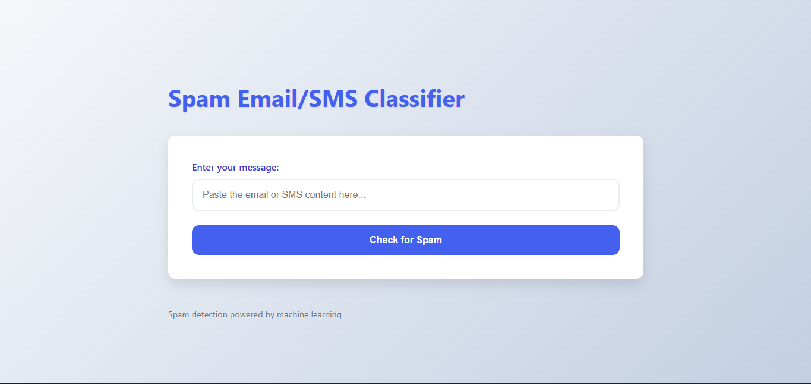
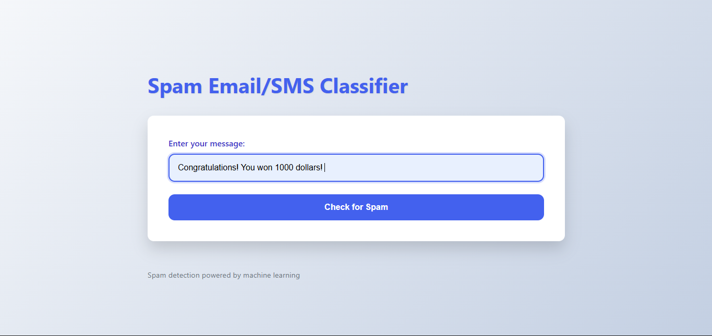
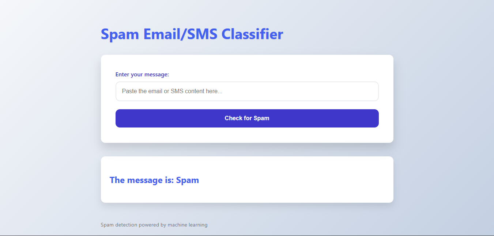

# Message Classifier using Naive Bayes

## Overview

This project implements a **Naive Bayes classifier** to classify text
messages as **spam** or **ham** (not spam).\
It uses the **Multinomial Naive Bayes** algorithm from `scikit-learn`
for training and testing.

## Features

-   Preprocessing of dataset (label encoding and text vectorization)
-   Naive Bayes classification
-   Model evaluation with accuracy and classification report

## Dataset

The dataset used is the **`spam.csv`** file containing labeled
SMS messages.

-   **label**: `spam` or `ham`
-   **message**: the text of the SMS

## Technologies Used

-   Python 3.x
-   Pandas
-   Scikit-learn

## How It Works

1.  Load and preprocess the dataset.
2.  Encode labels into numerical values.
3.  Convert text messages into numerical features using CountVectorizer.
4.  Train the Naive Bayes model.
5.  Evaluate the model performance.

## Example Output

    Accuracy: 98%
    Classification Report:
                  precision    recall  f1-score   support

             ham       0.98      1.00      0.99      1200
            spam       0.98      0.95      0.96       195

        accuracy                           0.98      1395
       macro avg       0.98      0.98      0.98      1395
    weighted avg       0.98      0.98      0.98      1395

## Installation

``` bash
pip install pandas scikit-learn
```

## Usage

``` bash
python app.py
```

## Screenshots

1.


2.


3.
